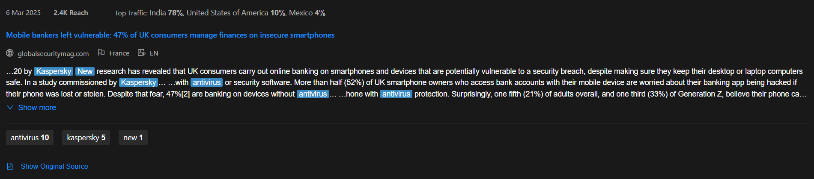

# News Snippet Application

Приложение для отображения новостных сниппетов с возможностью просмотра оригинального источника и фильтрации по ключевым словам. *Проект доступен по адресу: [News Snippet на GitHub Pages](https://top4ik228-akey-ivan.github.io/news-snippet/)*

## Технологии

- React 18 (TypeScript)
- Vite (сборщик)
- Ant Design (UI компоненты)
- SCSS (стилизация)

## Особенности

- Адаптивный интерфейс
- Подсветка ключевых слов
- Возможность развернуть/свернуть текст
- Просмотр оригинального источника
- Фильтрация по тегам
- Локализация дат и чисел

## Установка и запуск

1. Клонируйте репозиторий: `git clone https://github.com/top4ik228-akey-ivan/news-snippet.git`
2. Перейдите в папку проекта: `cd news-snippet`
3. Установите зависимости: `yarn install`
4. Запустите dev-сервер: `yarn dev`
5. Для production-сборки: `yarn build`
6. Для деплоя на GitHub Pages: `yarn deploy`
